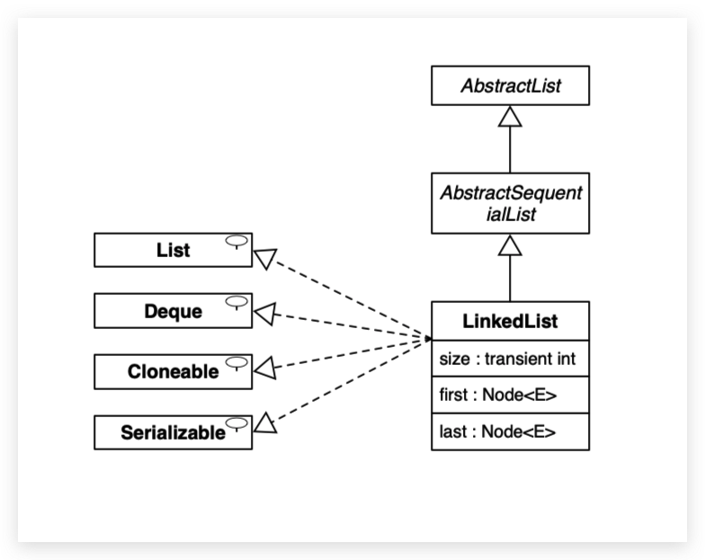

# LinkedList

## 1-简介

链表（Linked list）是一种常见的基础数据结构，是一种线性表，但是并不会按线性的顺序存储数据，而是在每一个节点里存到下一个节点的地址。

链表可分为单向链表和双向链表。

**以下情况使用 ArrayList :**

- 频繁访问列表中的某一个元素。
- 只需要在列表末尾进行添加和删除元素操作。

**以下情况使用 LinkedList :**

- 你需要通过循环迭代来访问列表中的某些元素。
- 需要频繁的在列表开头、中间、末尾等位置进行添加和删除元素操作。

```java
LinkedList 继承了 AbstractSequentialList 类。

LinkedList 实现了 Queue 接口，可作为队列使用。

LinkedList 实现了 List 接口，可进行列表的相关操作。

LinkedList 实现了 Deque 接口，可作为队列使用。

LinkedList 实现了 Cloneable 接口，可实现克隆。

LinkedList 实现了 java.io.Serializable 接口，即可支持序列化，能通过序列化去传输。
```



## 2-常用方法

| 方法                                           | 描述                                                         |
| ---------------------------------------------- | ------------------------------------------------------------ |
| public boolean add(E e)                        | 链表末尾添加元素，返回是否成功，成功为 true，失败为 false。  |
| public void add(int index, E element)          | 向指定位置插入元素。                                         |
| public boolean addAll(Collection c)            | 将一个集合的所有元素添加到链表后面，返回是否成功，成功为 true，失败为 false。 |
| public boolean addAll(int index, Collection c) | 将一个集合的所有元素添加到链表的指定位置后面，返回是否成功，成功为 true，失败为 false。 |
| public void addFirst(E e)                      | 元素添加到头部。                                             |
| public void addLast(E e)                       | 元素添加到尾部。                                             |
| public boolean offer(E e)                      | 向链表末尾添加元素，返回是否成功，成功为 true，失败为 false。 |
| public boolean offerFirst(E e)                 | 头部插入元素，返回是否成功，成功为 true，失败为 false。      |
| public boolean offerLast(E e)                  | 尾部插入元素，返回是否成功，成功为 true，失败为 false。      |
| public void clear()                            | 清空链表。                                                   |
| public E removeFirst()                         | 删除并返回第一个元素。                                       |
| public E removeLast()                          | 删除并返回最后一个元素。                                     |
| public boolean remove(Object o)                | 删除某一元素，返回是否成功，成功为 true，失败为 false。      |
| public E remove(int index)                     | 删除指定位置的元素。                                         |
| public E poll()                                | 删除并返回第一个元素。                                       |
| public E remove()                              | 删除并返回第一个元素。                                       |
| public boolean contains(Object o)              | 判断是否含有某一元素。                                       |
| public E get(int index)                        | 返回指定位置的元素。                                         |
| public E getFirst()                            | 返回第一个元素。                                             |
| public E getLast()                             | 返回最后一个元素。                                           |
| public int indexOf(Object o)                   | 查找指定元素从前往后第一次出现的索引。                       |
| public int lastIndexOf(Object o)               | 查找指定元素最后一次出现的索引。                             |
| public E peek()                                | 返回第一个元素。                                             |
| public E element()                             | 返回第一个元素。                                             |
| public E peekFirst()                           | 返回头部元素。                                               |
| public E peekLast()                            | 返回尾部元素。                                               |
| public E set(int index, E element)             | 设置指定位置的元素。                                         |
| public Object clone()                          | 克隆该列表。                                                 |
| public Iterator descendingIterator()           | 返回倒序迭代器。                                             |
| public int size()                              | 返回链表元素个数。                                           |
| public ListIterator listIterator(int index)    | 返回从指定位置开始到末尾的迭代器。                           |
| public Object[] toArray()                      | 返回一个由链表元素组成的数组。                               |

## 3-底层实现

**LinkedList的底层是通过链表来实现的**，因此它的随机访问速度是比较差的，但是它的删除，插入操作很快。

- LinkedList的底层使用的是 **双向链表** 数据结构（**JDK1.6 之前为循环链表，JDK1.7 取消了循环**)，除了可以当作链表操作外，它还可以当作栈、队列和双端队列来使用。
- LinkedList是非线程安全的，只在单线程下适合使用。
- LinkedList实现了Serializable接口，因此它支持序列化，能够通过序列化传输。

### 3.1-基本属性

```java
transient int size = 0;     //LinkedList中存放的元素个数
transient Node<E> first;    //头节点
transient Node<E> last;     //尾节点
```

### 3.2-**数据结构原理**

LinkedList底层的数据结构是基于双向循环链表的，且头结点中不存放数据,每个节点都有一个前驱和后继，如下：


### 3.3-添加方法

```java
public class LinkedList<E>extends AbstractSequentialList<E>
    implements List<E>, Deque<E>, Cloneable, java.io.Serializable {

    transient int size = 0;   //LinkedList中存放的元素个数

    transient Node<E> first;  //头节点
    
    transient Node<E> last;   //尾节点

	 //构造方法，创建一个空的列表
    public LinkedList() {
    }

    //将一个指定的集合添加到LinkedList中，先完成初始化，在调用添加操作
    public LinkedList(Collection<? extends E> c) {
        this();
        addAll(c);
    }

    //插入头节点
    private void linkFirst(E e) {
        final Node<E> f = first;  //将头节点赋值给f节点
        //new 一个新的节点，此节点的data = e , pre = null , next - > f 
        final Node<E> newNode = new Node<>(null, e, f);
        first = newNode; //将新创建的节点地址复制给first
        if (f == null)  //f == null，表示此时LinkedList为空
            last = newNode;  //将新创建的节点赋值给last
        else
            f.prev = newNode;  //否则f.前驱指向newNode
        size++;
        modCount++;
    }

    //插入尾节点
    void linkLast(E e) {
        final Node<E> l = last; 
        final Node<E> newNode = new Node<>(l, e, null);
        last = newNode;
        if (l == null)
            first = newNode;
        else
            l.next = newNode;
        size++;
        modCount++;
    }
    
    //Node
    private static class Node<E> {
        E item;
        Node<E> next;
        Node<E> prev;

        Node(Node<E> prev, E element, Node<E> next) {
            this.item = element;
            this.next = next;
            this.prev = prev;
        }
    }
 }
//添加方法默认是添加到LinkedList的尾部，首先将last指定的节点赋值给l节点，然后新建节点newNode,此节点的前驱指向l节点，data = e,next = null，并将新节点赋值给last节点，它成为了最后一个节点，根据当前List是否为空做出相应的操作。若不为空将l的后继指针修改为newNode，并且size++,modCount++;
```

```java
public boolean addAll(int index, Collection<? extends E> c) {
        checkPositionIndex(index);

        Object[] a = c.toArray();
        int numNew = a.length;
        if (numNew == 0)
            return false;

        Node<E> pred, succ;
        if (index == size) {
            succ = null;
            pred = last;
        } else {
            succ = node(index);
            pred = succ.prev;
        }

        for (Object o : a) {
            @SuppressWarnings("unchecked") E e = (E) o;
            Node<E> newNode = new Node<>(pred, e, null);
            if (pred == null)
                first = newNode;
            else
                pred.next = newNode;
            pred = newNode;
        }

        if (succ == null) {
            last = pred;
        } else {
            pred.next = succ;
            succ.prev = pred;
        }

        size += numNew;
        modCount++;
        return true;
    }
```

### 3.4-删除方法

```java
public boolean remove(Object o) { //删除方法，先循环遍历列表，找到item == o 的节点，在调用unlink()方法删除
        if (o == null) {
            for (Node<E> x = first; x != null; x = x.next) {
                if (x.item == null) {
                    unlink(x);
                    return true;
                }
            }
        } else {
            for (Node<E> x = first; x != null; x = x.next) {
                if (o.equals(x.item)) {
                    unlink(x);
                    return true;
                }
            }
        }
        return false;
}
 E unlink(Node<E> x) {
        // assert x != null;
        final E element = x.item;
        final Node<E> next = x.next;
        final Node<E> prev = x.prev;

        if (prev == null) {
            first = next;
        } else {
            prev.next = next;
            x.prev = null;
        }

        if (next == null) {
            last = prev;
        } else {
            next.prev = prev;
            x.next = null;
        }

        x.item = null;
        size--;
        modCount++;
        return element;
 }
```

## 4-List实现类的使用场景

- ArrayList，底层采用数组实现，如果需要遍历集合元素，应该使用随机访问的方式，对于LinkedList集合应该采用迭代器的方式
- 如果需要经常的插入。删除操作可以考虑使用LinkedList集合
- 如果有多个线程需要同时访问List集合中的元素，开发者可以考虑使用Collections将集合包装成线程安全的集合。

## 5-补充说明

1. 从源码中很明显可以看出，LinkedList的实现是基于(双向)循环链表的，且头结点中不存放数据。
2. 注意两个不同的构造方法。无参构造方法直接建立一个仅包含head节点的空链表，包含Collection的构造方法，先调用无参构造方法建立一个空链表，而后将Collection中的数据加入到链表的尾部后面。
3. 在查找和删除某元素时，源码中都划分为该元素为null和不为null两种情况来处理，LinkedList中允许元素为null。
4. LinkedList是基于链表实现的，因此不存在容量不足的问题，所以这里没有扩容的方法。
5. 注意源码中的Entry<E> entry(int index)方法。该方法返回双向链表中指定位置处的节点，而链表中是没有下标索引的，要指定位置出的元素，就要遍历该链表，从源码的实现中，我们看到这里有一个加速动作。源码中先将index与长度size的一半比较，如果index<size/2，就只从位置0往后遍历到位置index处，而如果index>size/2，就只从位置size往前遍历到位置index处。这样可以减少一部分不必要的遍历，从而提高一定的效率（实际上效率还是很低）。
6. 注意链表类对应的数据结构Entry。
7. LinkedList是基于链表实现的，因此插入删除效率高，查找效率低（虽然有一个加速动作）。
8. 要注意源码中还实现了栈和队列的操作方法，因此也可以作为栈、队列和双端队列来使用。

## 6-总结

- LinkedList是一个功能很强大的类，可以被当作List集合，双端队列和栈来使用。
- LinkedList底层使用链表来保存集合中的元素，因此随机访问的性能较差，但是插入删除时性能非常的出色。
- LinkedList在1.8版本有添加了一点新的内容，添加了一个static final 修饰的内部类LLSpliterator 并实现了Spliterator ，为了实现并行遍历而新添加的功能，整体的变化并不是很大，感兴趣的可以自己去看一下。
